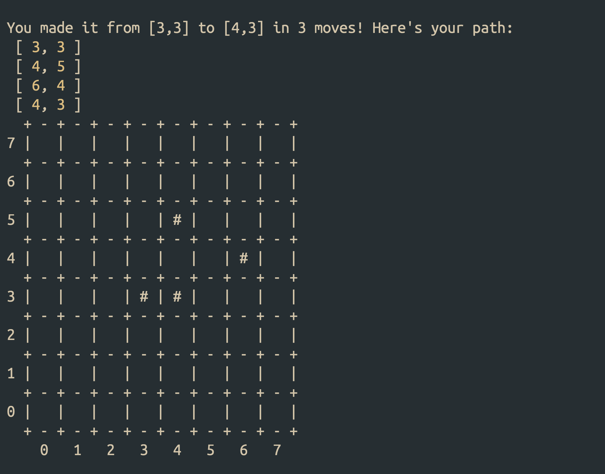

# The Odin Project - Knights Travails

This is the solution to The Odin Project's [Knights Travails](https://www.theodinproject.com/lessons/javascript-knights-travails#introduction) challenge. The goal is to use graphs to find the shortest path from point A to point B on a chessboard, using only valid Knight moves.

## The file structure

The main logic is in `src/knight.js`. It has the main `knightMoves` function that actually finds the shortest path. `src/index.js` imports this function, as well as some helpers from `src/helper.js` to display the output.

## How to use

Clone the repo and run:

```sh
node --watch src/index.js
```

The main function, `knightMoves`, takes two arguments: `start` and `finish`, each as a 2-element array of `x-y` coordinates on the chessboard. The coordinates start from `[0, 0]` for the first square, all the way to `[7, 7]` for the last square.

The output is the shortest path between these two points, in the form of an array of coordinates the Knight piece would pass by to reach the finish point. For example:

```js
const shortestPath = knightMoves([3, 3], [4, 3]);
console.log(shortestPath); // -> [[ 3, 3 ], [ 4, 5 ], [ 6, 4 ], [ 4, 3 ]]
```

Two helper functions, `printMessage` and `drawBoard`, take the output of `knightMoves` and display the result in the console.

## The algorithm, in abstract terms

The Knight piece can move in 8 different ways (various orientations of the L move):

- 1 right, 2 up
- 2 right, 1 up
- 2 right, 1 down
- and so on

Following each of these moves, it can again move in 8 different ways. This process repeats until the Knight reaches the finish point, or a dead end. My first hunch was to build a depth-first tree of all possible combinations. The root node would have 8 children, each with 8 of their own, all the way to either the finish point or a dead end. I could not make that work. I could build the tree, but I couldn’t traverse it to actually build the shortest path.

So I switched to a breadth-first approach. I would first try all the single moves and check if it leads the Knight to the finish point. If not, I would try all the double moves. Since each move can go 8 possible ways, double moves will have 64 possible combinations (8 x 8). If that didn’t work, I would try the triple moves (512 combinations). I would repeat the process until a match is found. Since we’re starting the trial process from the shortest possibilities (single moves), the first match is ought to be the shortest one.

## How I coded the algorithm

The 8 valid Knight moves are represented as an array of arrays:

```js
const moves = [
  [1, 2],
  [2, 1],
  [2, -1],
  [1, -2],
  [-1, -2],
  [-2, -1],
  [-2, 1],
  [-1, 2],
];
```

Four functions in `knight.js` work with this array:

### `getMoveCombos`

It takes a `count` and `moves` as arguments, and generates a set of all the combinations that have `count` moves: all the 1-move, 2-moves, 3-moves, and so on. The output for the 3-moves combos looks like this:

```js
const all3Moves = getMoveCombos(3, moves);
console.log(all3Moves);

/*
[
  [ [ 1, 2 ], [ 1, 2 ], [ 1, 2 ] ],
  [ [ 1, 2 ], [ 1, 2 ], [ 2, 1 ] ],
  [ [ 1, 2 ], [ 1, 2 ], [ 2, -1 ] ],
  [ [ 1, 2 ], [ 1, 2 ], [ 1, -2 ] ],
  [ [ 1, 2 ], [ 1, 2 ], [ -1, -2 ] ],
  [ [ 1, 2 ], [ 1, 2 ], [ -2, -1 ] ],
  [ [ 1, 2 ], [ 1, 2 ], [ -2, 1 ] ],
  [ [ 1, 2 ], [ 1, 2 ], [ -1, 2 ] ],
  [ [ 1, 2 ], [ 2, 1 ], [ 1, 2 ] ],
  [ [ 1, 2 ], [ 2, 1 ], [ 2, 1 ] ],
  [ [ 1, 2 ], [ 2, 1 ], [ 2, -1 ] ],
  [ [ 1, 2 ], [ 2, 1 ], [ 1, -2 ] ],
  [ [ 1, 2 ], [ 2, 1 ], [ -1, -2 ] ],
  [ [ 1, 2 ], [ 2, 1 ], [ -2, -1 ] ],
  // ...
]
*/
```

Each sub-array is one single **move-combo**:

- First one is `[[ 1, 2 ], [ 1, 2 ], [ 1, 2 ]]`
- Second one is `[[ 1, 2 ], [ 1, 2 ], [ 2, 1 ]]`
- and so on.

### `convertComboToPath`

It takes one single move-combo (from the previous set) and a `start` position and builds an actual path of chessboard positions. For example, starting from `[2, 1]` and following the first move-combo from the 3-moves set, we’ll get this:

```js
const pathFromFirstCombo = convertComboToPath([2, 1], all3Moves[0]);
console.log(pathFromFirstCombo);

// -> [[ 2, 1 ], [ 3, 3 ], [ 4, 5 ], [ 5, 7 ]]
```

If any move-combo leads the Knight to an off-board position (like `[2, 8]` or `-1, 2]`), `null` is returned.

### `findPath`

It loops over all the move combos from the first function, `getMoveCombos`, runs `convertComboToPath` on each one, and checks if it’s a valid path. If one is found, it is immediately returned as the output, terminating the loop. If the loop ends without finding one, `null` is returned.

```js
const path1 = findPath([0, 0], [3, 4], all3Moves);
const path2 = findPath([0, 0], [3, 3], all3Moves);

console.log(path1); // -> [[ 0, 0 ], [ 2, 1 ], [ 4, 2 ], [ 3, 4 ]]
console.log(path2); // -> null (no 3-move path between given positions)
```

### `knightMoves`

It starts by building an array of single-move combos, and tries to find a possible path within them. If one is found, it is returned as the solution. Otherwise, it recursively calls itself to try the 2-move combos, 3-move combos, etc. The recursion continues until a path is found. The recursion is controlled by passing a third argument, `count`, that is incremented by `1` in each recursive call.

This function also has a guard clause to immediately reject invalid `start` and `finish` positions. The only guard against an infinite recursion is the fact that a path is eventually found. There is no combination of `start` and `finish` positions that does not ultimately lead to a valid path. I tried all 4096 combinations (using 4 nested `for` loops 😉). If that were not the case, the recursion would continue until the _heap_ overflows.

## Limitations and areas for improvement

The main problem is about space and time complexities. There are multiple deeply nested recursions that check for all possibilities, regardless of them being valid or not. For example, the set of all move combinations is created in its entirety in each recursive call of `knightMoves`, and then, `findPath` is run on each one. It’s 8 times for the first call, 64 for the second call, 512, 4096, and so on. There are 4 combinations of `start` and `finish` that yield a 7-moves path (corners to corners), and there are 2,097,152 combinations of 7-moves! This combination is created regardless of where in that combination the shortest path happens to be. This is in addition to all the lower count combinations that were created with no valid paths from the previous recursions.

While there may be more than one fastest path between two points, this implementation returns the first one found and ignores the rest. This is acceptable behavior as per the project’s requirements, but it can be an area of improvement. It’s actually very easy, as it only needs a small modification to `findPath`. Instead of it terminating immediately upon finding the first valid path, I modified it to keep adding them to an array:

```js
function findPath(start, finish, combos) {
  const paths = [];
  for (let combo of combos) {
    const path = convertComboToPath(start, combo);
    if (path && isSamePosition(path.at(-1), finish)) paths.push(path);
  }

  return paths.length ? paths : null;
}
```

No further changes were needed. Now, calling `knightMoves` would return an array of valid paths, all of equal length. It’s interesting to learn that this code returned 108 valid paths for `[0,0], [7,7]`!

I did not implement this iteration in the final submission, as it made the presentation logic a bit too complex.

## Reflection

This project broke me. When I finally solved it, I didn't cheer, like I always do when I crack a hard programming task. It was more of a relief than excitement. It took me 11 days of full-time work. For context, the [ToDo project](https://github.com/sydalwedaie/odin-project-todo) took much longer (34 days), but at least I knew what I needed to do. This one, however, was so complex I couldn't even form a plan of action for days. Even then, it took me days of experimentation and dead ends, each one taking me half a millimeter closer to the finish line.

Halfway through, I had to ask the Discord community for help. An awesome member walked me, step by step, through a non-coding scenario to learn about the algorithm in abstract terms. That was a worthwhile exercise, as I learned how I was drowning myself in technical terms. I went there asking how I could use an _adjacency list_. They instead told me:

> […] instead of thinking about what the problem _actually_ is, then seeing how you could solve that problem, it looked like you were starting with possible tools for solutions then trying to find the problem that could use those tools as solutions. That's the complete wrong way round.

This is profound, especially in this AI-driven age of coding (and learning to code). A few times in the past, I would resort to AI to _help_ me solve a problem without giving me the solution, after struggling for a few hours or a day or two at most. For this one, I made it a goal to never touch it. An LLM would have most probably tried to _help_ me shoe-horn an adjacency list into the solution, even if it wasn’t a good tool for this project. The community, however, saw the bigger problem and helped accordingly. From there, I didn't have sudden flashes of ingenuity or anything; I just kept experimenting, moving ever so slightly closer to the solution until one last run when it finally worked.
